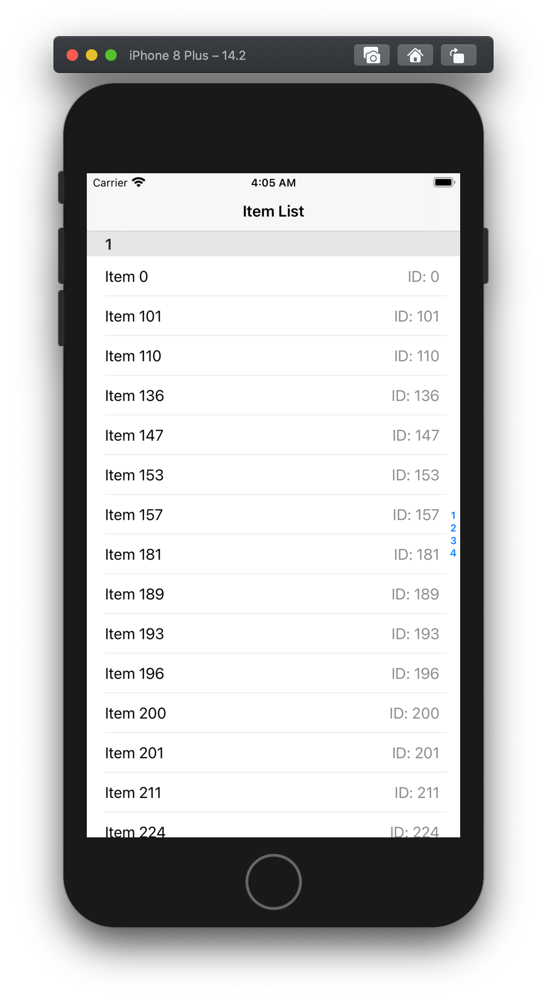

# ItemList

      

## Project Overview

ItemList provides a smooth and efficient way to navigate data from https://fetch-hiring.s3.amazonaws.com/hiring.json 

 

### Key Features

- List view of hiring data
- Section titles 
- Index 
